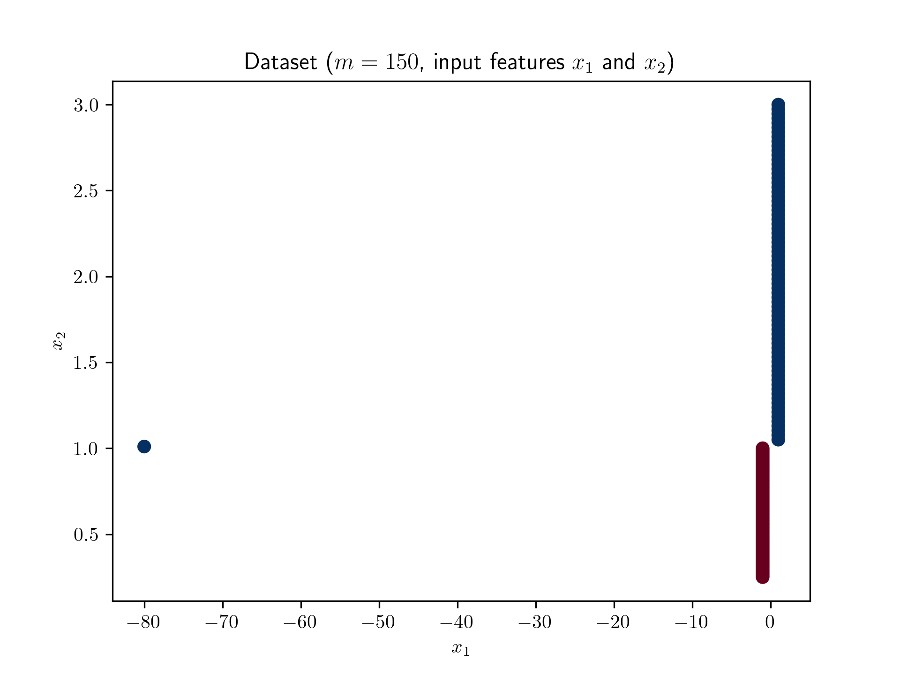
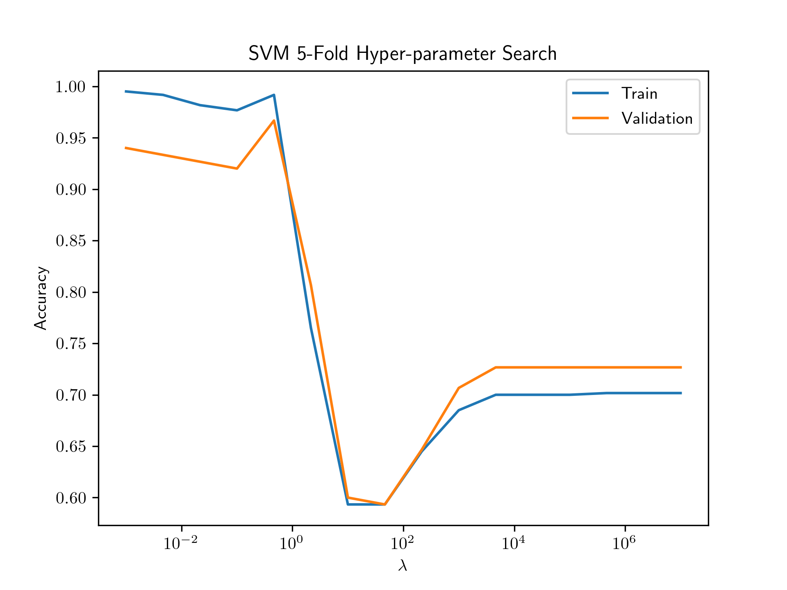

# 236756 Moed A Question 1

This repostiory includes an example for a datset on which the SVM classifier's hyperparameter search is nearly identical to Diagram B from the question. 

The dataset with 150 samples and two features consists of 75 positive examples on a line, 74 negative samples on a line, and a single negative sample far to the left:

The hyperparameter search is performed for lambda in the range from 1e-3 to 1e7, using 5-fold validation:

The coutnerexample exploits the fact that optimizing hinge-loss is not the same as optimizing accuracy (as discussed in the Lecture). Therefore, a single outlier far from the origin can have a more significant impact on the loss than multiple samples near the origin. 
